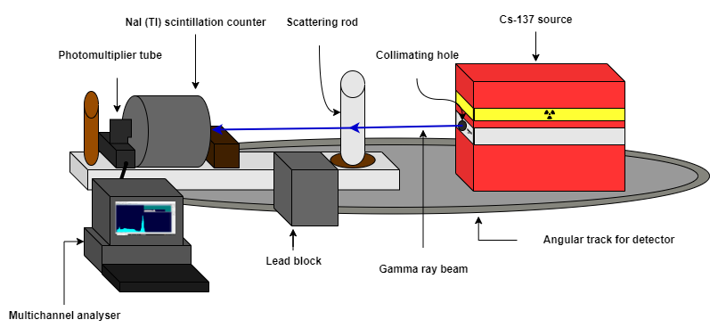

# Colloidal Information Engine Project:

## Contents

* Initialise project directory
* Cython setup 
* Model constants 
* Ensemble generator 
* Power calculator 
* Analysis scripts
* Data plotter 
* Power Spectral density calculator
* Cluster computing

Have docstrings on all functions but refer to readme file at the top of each separate script for a script summary.

Also, use draw.io to make a diagram which will be used in lab book, report, and this readme file to be seen in the Git repository.

May be important to check out the GitHub environment tab such that the compute Canada virtual environment works for others�

### Initialise project directory

### Cython setup 

### Model constants

~~~~
NOISE_MODEL = 1

SAMPLE_PATHS = 1000
N = 100_000
PROTOCOL_TIME = 10
DELTA_T = PROTOCOL_TIME / N

MEASURING_FREQUENCY = 1/DELTA_T
THRESHOLD = 0
OFFSET = 0

TRANSIENT_FRACTION = 0.1
~~~~

### Ensemble generator

### Power calculator

### Analysis scripts

1. Correlation time analysis
2. Noise strength analysis
3. feedback gain analysis

### Data plotter

### Power spectral density calculator

### Cluster computing

 
 
 

_This is in itallic_  
**This is in bold**

|Name|Email|Address|
|----|-----|-------|
|John|john@example.com|Address1|
